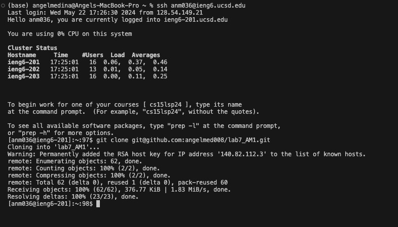
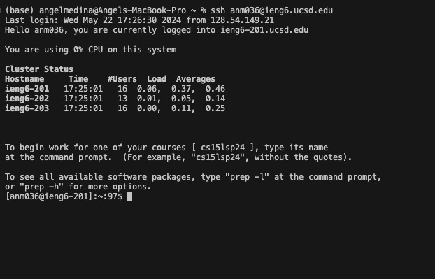
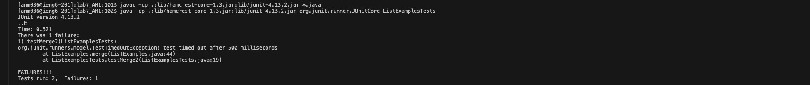
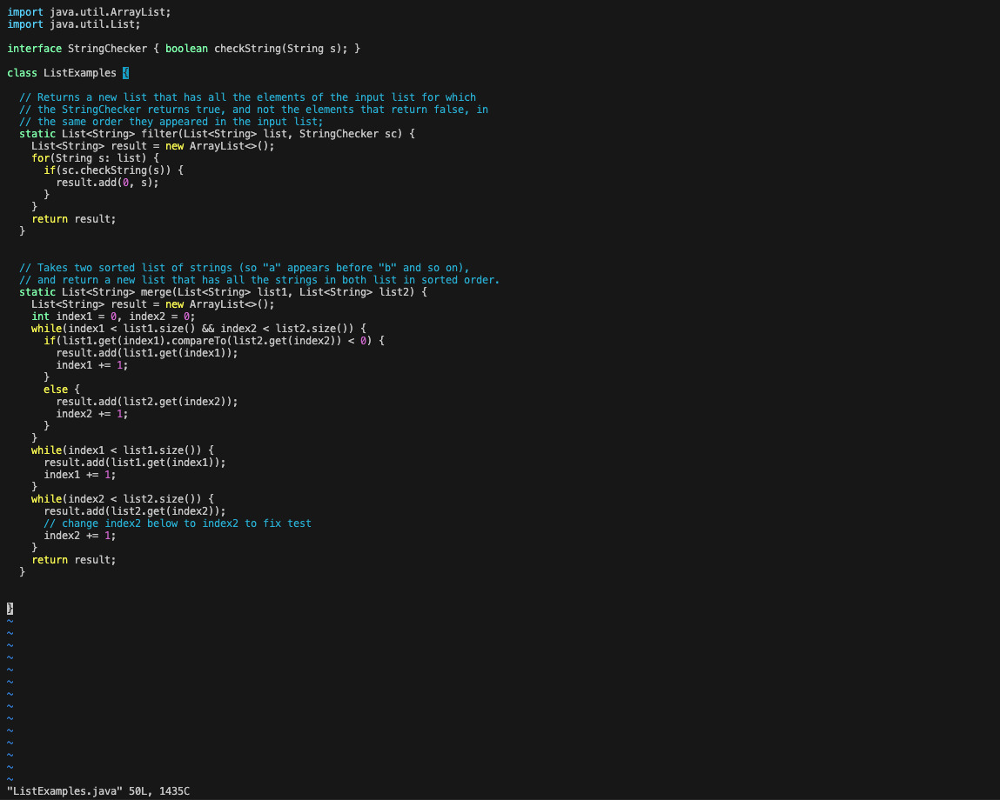
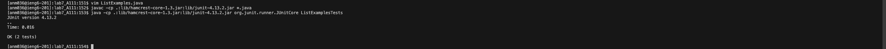
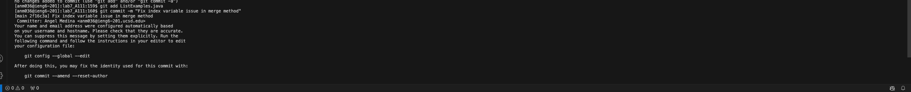
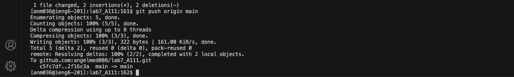

Lab Report 4

---

To edit the `ListExamples.java` file in Vim, I pressed `vim<space>ListExamples.java<enter>` to open the file. Then, I pressed `/index2<enter>` to search for the first occurrence of `index2`. Once found, I pressed `cwindex1<esc>` to change `index2` to `index1`. To find the next occurrence, I pressed `n`, and then `cwindex1<esc>` to make the same change. I repeated this by pressing `n` and `cwindex1<esc>` until all occurrences of `index2` were changed to `index1`. After making all the changes, I pressed `:wq<enter>` to save and exit Vim. Next, I compiled the Java files by pressing `javac<space>-cp<space>.:lib/hamcrest-core-1.3.jar:lib/junit-4.13.2.jar<space>*.java<enter>`. Finally, I ran the JUnit tests by pressing `java<space>-cp<space>.:lib/hamcrest-core-1.3.jar:lib/junit-4.13.2.jar<space>org.junit.runner.JUnitCore<space>ListExamplesTests<enter>`. The commands ensured that the `index2` variable was correctly changed to `index1`, the Java files were compiled, and the tests were run successfully.

---
Photos:

